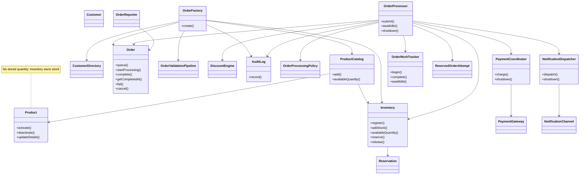

# OrderFlow class diagram

```mermaid
classDiagram
    class Product {
        +activate()
        +deactivate()
        +updateDetails()
    }
    class ProductCatalog {
        +add()
        +availableQuantity()
    }
    class Inventory {
        +register()
        +addStock()
        +availableQuantity()
        +reserve()
        +release()
    }
    class Reservation
    class Customer
    class CustomerDirectory
    class Order {
        +queue()
        +startProcessing()
        +complete()
        +getCompletedAt()
        +fail()
        +cancel()
    }
    class OrderFactory {
        +create()
    }
    class OrderValidationPipeline
    class DiscountEngine
    class AuditLog {
        +record()
    }
    class PaymentGateway
    class NotificationChannel
    class OrderProcessor {
        +submit()
        +awaitIdle()
        +shutdown()
    }
    class OrderProcessingPolicy
    class PaymentCoordinator {
        +charge()
        +shutdown()
    }
    class NotificationDispatcher {
        +dispatch()
        +shutdown()
    }
    class OrderWorkTracker {
        +begin()
        +complete()
        +awaitIdle()
    }
    class ReservedOrderAttempt
    class OrderReporter

    note for Product "No stored quantity; Inventory owns stock"
    ProductCatalog --> Product
    ProductCatalog --> Inventory
    Inventory --> Reservation
    OrderFactory --> CustomerDirectory
    OrderFactory --> ProductCatalog
    OrderFactory --> Inventory
    OrderFactory --> OrderValidationPipeline
    OrderFactory --> AuditLog
    OrderFactory --> Order
    OrderProcessor --> Order
    OrderProcessor --> Inventory
    OrderProcessor --> DiscountEngine
    OrderProcessor --> OrderProcessingPolicy
    OrderProcessor --> PaymentCoordinator
    OrderProcessor --> NotificationDispatcher
    OrderProcessor --> OrderWorkTracker
    OrderProcessor --> ReservedOrderAttempt
    PaymentCoordinator --> PaymentGateway
    NotificationDispatcher --> NotificationChannel
    OrderProcessor --> AuditLog
    OrderReporter --> Order
```
