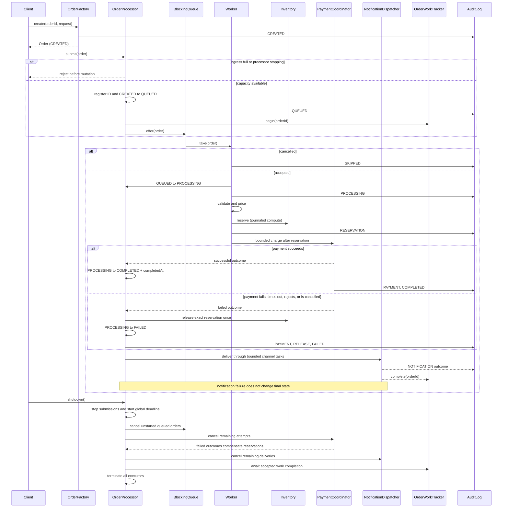

# Order processing sequence

```mermaid
sequenceDiagram
    participant Client
    participant Factory as OrderFactory
    participant Processor as OrderProcessor
    participant Queue as BlockingQueue
    participant Worker
    participant Inventory
    participant Payment as PaymentCoordinator
    participant Notify as NotificationDispatcher
    participant Tracker as OrderWorkTracker
    participant Audit as AuditLog

    Client->>Factory: create(orderId, request)
    Factory->>Audit: CREATED
    Factory-->>Client: Order (CREATED)
    Client->>Processor: submit(order)
    alt ingress full or processor stopping
        Processor-->>Client: reject before mutation
    else capacity available
        Processor->>Processor: register ID and CREATED to QUEUED
        Processor->>Audit: QUEUED
        Processor->>Tracker: begin(orderId)
        Processor->>Queue: offer(order)
    end
    Queue->>Worker: take(order)
    alt cancelled
        Worker->>Audit: SKIPPED
    else accepted
        Worker->>Processor: QUEUED to PROCESSING
        Worker->>Audit: PROCESSING
        Worker->>Worker: validate and price
        Worker->>Inventory: reserve (journaled compute)
        Worker->>Audit: RESERVATION
        Worker->>Payment: bounded charge after reservation
        alt payment succeeds
            Payment-->>Processor: successful outcome
            Processor->>Processor: PROCESSING to COMPLETED + completedAt
            Payment->>Audit: PAYMENT, COMPLETED
        else payment fails, times out, rejects, or is cancelled
            Payment-->>Processor: failed outcome
            Processor->>Inventory: release exact reservation once
            Processor->>Processor: PROCESSING to FAILED
            Processor->>Audit: PAYMENT, RELEASE, FAILED
        end
        Processor->>Notify: deliver through bounded channel tasks
        Notify-->>Audit: NOTIFICATION outcome
        Notify-->>Tracker: complete(orderId)
        Note over Notify,Processor: notification failure does not change final state
    end
    Client->>Processor: shutdown()
    Processor->>Processor: stop submissions and start global deadline
    Processor->>Queue: cancel unstarted queued orders
    Processor->>Payment: cancel remaining attempts
    Payment-->>Processor: failed outcomes compensate reservations
    Processor->>Notify: cancel remaining deliveries
    Processor->>Tracker: await accepted work completion
    Processor->>Processor: terminate all executors
```
