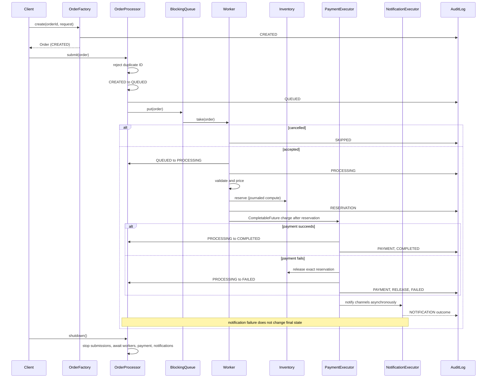

# Order processing sequence

```mermaid
sequenceDiagram
    participant Client
    participant Factory as OrderFactory
    participant Processor as OrderProcessor
    participant Queue as BlockingQueue
    participant Worker
    participant Inventory
    participant Payment as PaymentExecutor
    participant Notify as NotificationExecutor
    participant Audit as AuditLog

    Client->>Factory: create(orderId, request)
    Factory->>Audit: CREATED
    Factory-->>Client: Order (CREATED)
    Client->>Processor: submit(order)
    Processor->>Processor: reject duplicate ID
    Processor->>Processor: CREATED to QUEUED
    Processor->>Audit: QUEUED
    Processor->>Queue: put(order)
    Queue->>Worker: take(order)
    alt cancelled
        Worker->>Audit: SKIPPED
    else accepted
        Worker->>Processor: QUEUED to PROCESSING
        Worker->>Audit: PROCESSING
        Worker->>Worker: validate and price
        Worker->>Inventory: reserve (journaled compute)
        Worker->>Audit: RESERVATION
        Worker->>Payment: CompletableFuture charge after reservation
        alt payment succeeds
            Payment->>Processor: PROCESSING to COMPLETED
            Payment->>Audit: PAYMENT, COMPLETED
        else payment fails
            Payment->>Inventory: release exact reservation
            Payment->>Processor: PROCESSING to FAILED
            Payment->>Audit: PAYMENT, RELEASE, FAILED
        end
        Payment->>Notify: notify channels asynchronously
        Notify-->>Audit: NOTIFICATION outcome
        Note over Notify,Processor: notification failure does not change final state
    end
    Client->>Processor: shutdown()
    Processor->>Processor: stop submissions, await workers, payment, notifications
```
