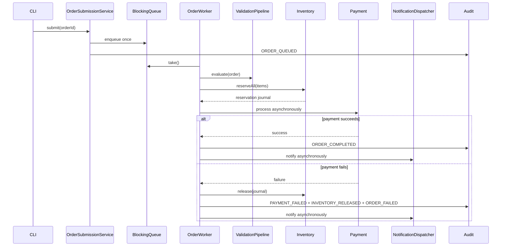

# OrderFlow Design

**Status:** Approved in conversation on 2026-08-21; product `SPEC.md` approved
on 2026-08-21.

## Goal and boundaries

Build a two-day, plain-Java 21 in-memory PoC that demonstrates object-oriented
design, collections, functional rules, streams, exceptions, concurrency,
testing, documentation, and controlled AI-assisted delivery. No Spring,
database, web API, Lombok, or external application framework.

## Chosen architecture

Use `core.domain` for models and `core.service` for operations under
`com.codewalnut.orderflow`. Keep concrete in-memory components unless a real
substitution boundary exists. Interfaces are appropriate for validation rules,
discount rules, payment, and notification. Do not add empty `web`, `mapper`,
`gateway`, or `config` packages. The CLI composes components; it does not
contain business logic.

Inventory uses `ConcurrentHashMap.compute` for atomic per-product changes.
Multi-product reservation sorts product IDs, records each successful decrement,
and compensates that journal if a later decrement fails. This avoids overselling
without a global inventory lock. A transient reservation may make another order
fail availability; correctness is preferred over retry/fairness in this PoC.

Orders own synchronized status transitions. The submission ID set is
thread-safe. A bounded `BlockingQueue` feeds a fixed worker pool. Submission
uses a short lifecycle critical section and rejects full capacity before
mutating the order. Dedicated bounded coordinators run payment and notification
work, expose `CompletableFuture` outcomes, enforce stage deadlines, and track
cancellable attempts for one global graceful-shutdown budget.

The 2026-08-23 review amendment splits processing responsibilities:

- `OrderProcessor` owns acceptance, workers, validation, pricing, reservation,
  and final-state orchestration.
- `PaymentCoordinator` owns bounded charge execution, timeout scheduling,
  cooperative interruption, and one outcome per submitted attempt.
- `NotificationDispatcher` owns bounded channel delivery, timeout/failure
  isolation, and aggregate delivery completion.
- `OrderWorkTracker` owns exactly-once accepted-work completion and idle waits.
- `OrderProcessingPolicy` owns worker counts, queue capacities, stage deadlines,
  and the global shutdown budget.

Payment reservation ownership remains in processing orchestration. A
`ReservedOrderAttempt` atomic settlement gate ensures success, failure, timeout,
rejection, and shutdown cancellation cannot complete or compensate the same
reservation twice. Adapters that ignore interruption violate the approved
boundary contract; unsafe forced thread termination remains out of scope.

## Components

- Catalog and Customer: unique maps/indexes and immutable query results.
- Order: aggregate, item snapshots, valid transitions, in-memory store.
- Validation/Pricing: ordered composable rules and immutable results.
- Inventory: atomic reserve/release and reservation journal.
- Processing: at-most-once submission, workers, orchestration, lifecycle.
- Payment/Notification: replaceable deterministic boundaries.
- Audit: concurrent immutable event storage and sorted snapshots.
- Reporting: immutable stream/collector results.

Discounted category/product revenue uses largest-remainder allocation in cents.
Each proportional share is floored, residual cents are assigned by descending
fractional remainder with item order as the tie-breaker, and allocations are
non-negative and exactly reconcile to the completed order's final amount.

## Data flow

## Error handling

Reject invalid input before storage mutation. Reservation failure compensates
partial decrements. Payment failure compensates the complete reservation.
Notification failure is isolated after final state. Worker boundaries catch and
record one order's failure without terminating the pool. Translated exceptions
retain causes and contextual IDs.

## Testing

Use JUnit 5 and RED/GREEN/REFACTOR. Unit-test invariants and rules; component-test
real in-memory stores; use deterministic fakes for payment/notifications;
coordinate concurrency with latches/barriers/futures and bounded timeouts.
Verify no overselling, at-most-once processing, exact compensation, failure
isolation, and clean shutdown. The full gate is `./mvnw clean verify` on JDK 21.

## Agentic workflow

Initial setup creates guidance, glossary, draft product spec, reusable skills,
Java rules, AI usage log, and PR template. No CI is added. After the human
approves `SPEC.md`, create and approve an implementation plan; then create and
approve traceable tasks; only then implement each task test-first and verify it.

## Specification layout

Use progressive disclosure rather than one oversized contract. `SPEC.md`
remains the canonical status, assumptions, scope, architecture, invariant, and
contract-index document. Detailed requirements, acceptance criteria, and
testing focus live in three capability chunks:

- `docs/specs/orderflow/01-core-domain.md`
- `docs/specs/orderflow/02-fulfilment.md`
- `docs/specs/orderflow/03-reporting-quality.md`

Agents read `SPEC.md`, `CONTEXT.md`, and only the chunk routed for the active
task. Requirement and acceptance-criteria IDs remain globally unique.
